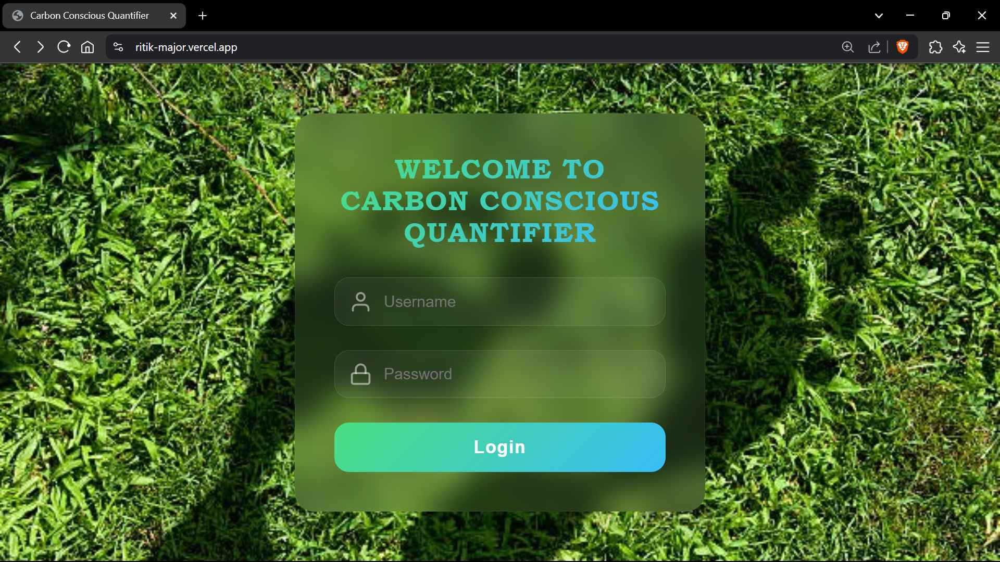
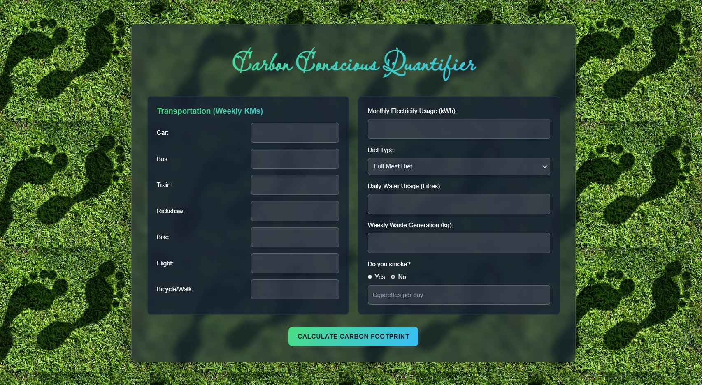
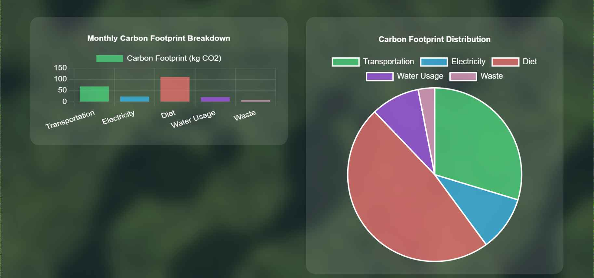
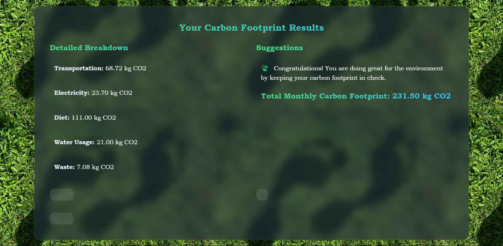
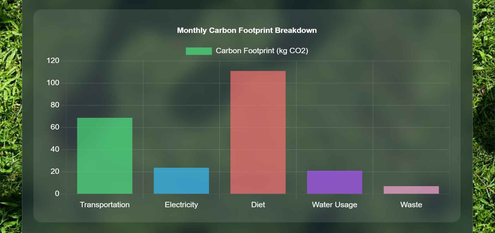
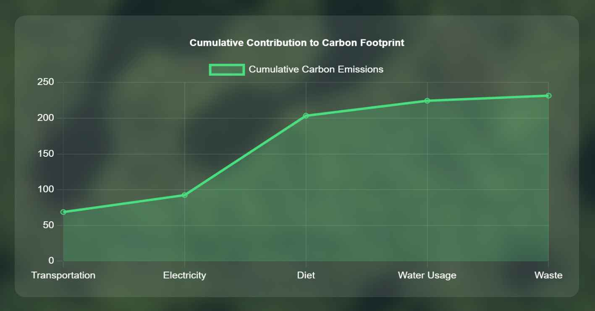
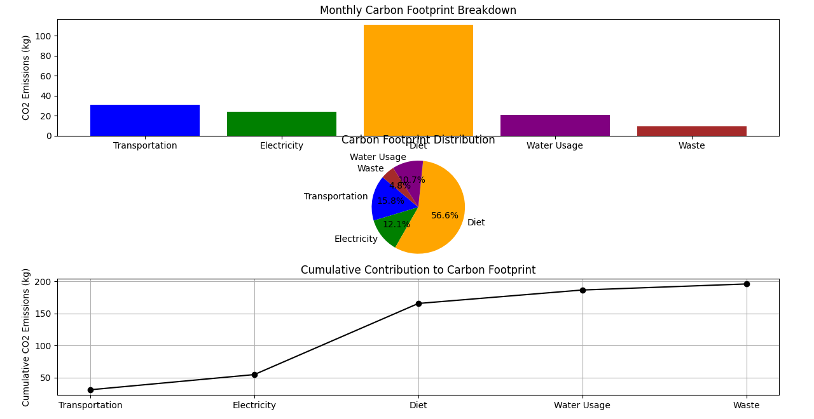

# Carbon Conscious Quantifier

An intelligent web application that calculates an individual's carbon footprint based on their daily activities, provides visual dashboard insights, and offers personalized suggestions to reduce environmental impact.

## 🌐 Live Demo

**Web Application**: [https://ritik-major.vercel.app/](https://ritik-major.vercel.app/)

**Login Credentials:**
- Username: `admin`
- Password: `password`

## 📋 Overview

The Carbon Conscious Quantifier helps users understand and reduce their environmental impact by:
- Calculating carbon footprint from daily activities
- Providing interactive visual dashboards
- Offering personalized reduction suggestions
- Tracking environmental impact over time

## ✨ Features

- **Carbon Footprint Calculator**: Analyze emissions from transportation, electricity, diet, and lifestyle choices
- **Visual Dashboard**: Interactive charts and graphs showing emission patterns
- **Personalized Recommendations**: Data-driven suggestions for reducing carbon footprint
- **Progress Tracking**: Monitor improvements and environmental impact
- **User-Friendly Interface**: Clean, intuitive web interface

## 🖼️ Screenshots

### Login Interface


### Main Dashboard


### Analytics Dashboard


### Results Analysis


### Data Visualization



### Development Environment


## 🎥 Demo Video


## 🚀 Getting Started

### Prerequisites
- Python 3.8+
- Required Python packages (see requirements.txt)

### Installation

1. Clone the repository:
   ```bash
   git clone https://github.com/yourusername/carbon-conscious-quantifier.git
   cd carbon-conscious-quantifier
   ```

2. Install dependencies:
   ```bash
   pip install -r requirements.txt
   ```

3. Run the application:
   ```bash
   python src/carbonconsciousquantifier.py
   ```

### Web Application
The web version is deployed on Vercel and provides enhanced functionality with an interactive user interface. Access it using the credentials provided above.

## 📊 Technology Stack

- **Backend**: Python
- **Frontend**: Web technologies
- **Data Visualization**: Interactive charts and graphs
- **Deployment**: Vercel
- **Analytics**: Carbon footprint calculation algorithms

## 🌍 Environmental Impact

This application promotes environmental awareness by:
- Making carbon footprint tracking accessible to everyone
- Providing actionable insights for sustainable living
- Encouraging eco-friendly lifestyle choices
- Supporting global sustainability goals

## 🤝 Contributing

Contributions are welcome! Please feel free to:
- Submit bug reports and feature requests
- Fork the repository and create pull requests
- Suggest improvements for carbon calculation accuracy
- Add new visualization features

## 📄 License

This project is licensed under the MIT License - see the [LICENSE](LICENSE) file for details.

## 👨‍💻 Author

**Ritik Pratap Singh Patel**

## 🔗 Links

- **Live Application**: [https://ritik-major.vercel.app/](https://ritik-major.vercel.app/)
- **GitHub Repository**: https://github.com/patelritiq/carbon-conscious-quantifier

---

*Making sustainability simple, one calculation at a time.* 🌱

